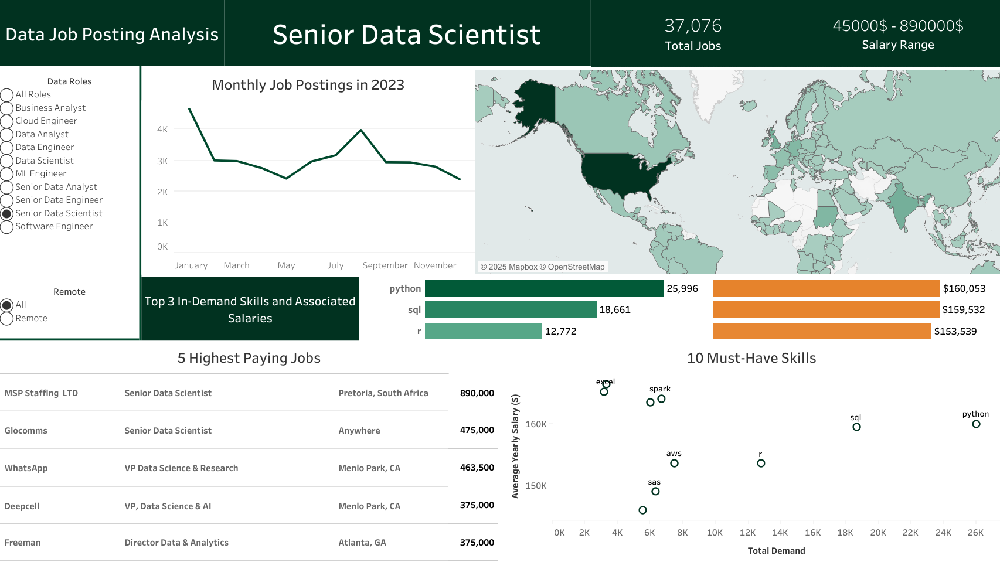

# Interactive Dashboard : Data Job Market Analysis

Welcome to my interactive dashboard project! This dashboard is designed to provide valuable insights into data job market by analyzing job postings from 2023. It serves as a comprehensive tool for individuals looking to explore career opportunities, identify high-value skills, and understand trends in the job market.
### Data 
The data used in this project originates from [Luke Barousse](https://lukebarousse.com/sql), who scraped job postings from Google's search results for various data-related roles. It has been cleaned and processed to ensure accuracy and relevance for analysis.
### Goal
The primary goal of this dashboard is to empower job seekers, career changers, and industry professionals with actionable insights into the evolving job market. Whether you're exploring new career paths or enhancing your skill set, this tool provides valuable guidance to help you make informed decisions.
### Key Features
- **Top Skills for Each Role:** Discover the most in-demand skills for each role and average salaries associated with them .  
- **Monthly Job Postings Trends:** Analyze trends in job postings to identify the most active months.
- **Top Paying Jobs:** Discover top 5 highest paying job opportunities for selected role .
- **10 Must Have Skills:** Find out about the must-haves to learn , chosen according to their demand and associated salaries.
- **Flexible Filtering Option:** Filter data by data roles , time , country and remote work option.
- **Interactive Visualizations:** Engage with dynamic charts and graphs for a user-friendly experience.

*Access the interactive version via this [Tableau Public link](https://public.tableau.com/views/DataJobAnalysis_17369523845880/JobAnalysis?:language=en-US&:sid=&:redirect=auth&:display_count=n&:origin=viz_share_link)*
